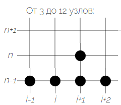
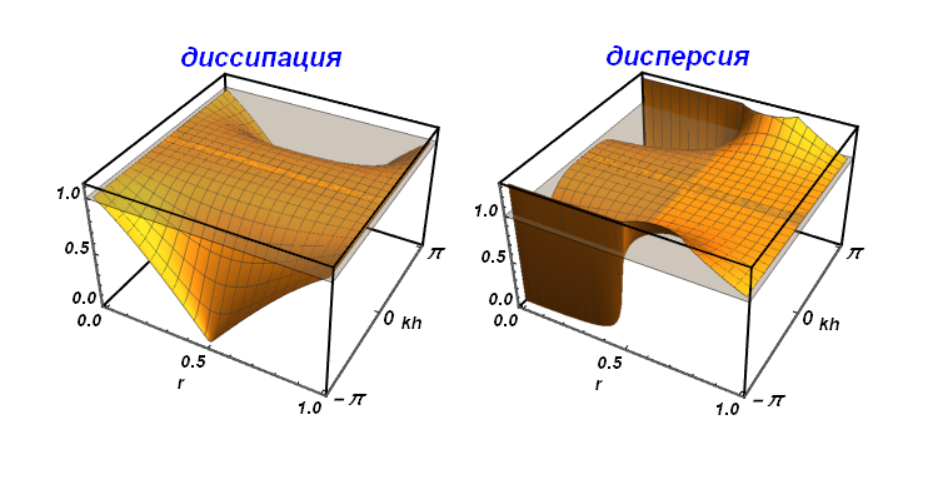
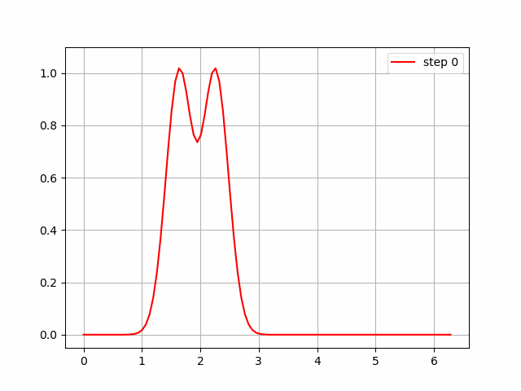
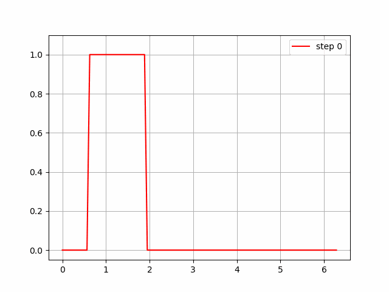

# Transfer_equation
В работе исследуются характеристики явной схемы четвертого порядка для решения начально-краевой задачи для уравнения переноса.

### Модельная задача

- Уравнение переноса

$$\dfrac{\partial u}{\partial t} + c \dfrac{\partial u}{\partial x} = 0, \\; c = 1; \\; t \in [0, \infty); $$

- Начально-краевые условия
  
$$u(x, 0) = f(x); \\; u(0, t) = u(2\pi, t); \\; x \in [0, 2\pi]$$

В качестве гладкого начального условия возьмем "двойной гауссиан" с параметрами:

$$f(x)=exp[-(x-x_1)^2 / \Delta^2] + exp[-(x-x_2)^2 / \Delta^2]$$

где $x_1=0.5 \pi$, $x_2=0.7\pi$, $\Delta=0.1\pi$. 

В качестве разрывного - "ступеньку":

$$f(x) = \begin{cases}
    1, если \\; 0.1\pi \le x \le 0.3\pi \\
    0, иначе
\end{cases}$$

Аппроксимируем дифференциальную задачу разностной схемой со следующим шаблоном:

Формулу разностной схемы получим с помощью метода обратных характеристик:

$$
\begin{split}
	u_{j}^{n+1} = - u_{j-2}^{n} \dfrac{(1-r)r(1+r) }{6} + u_{j-1}^{n} \dfrac{(2-r)r(1+r) }{2}& \\
	+ u_{j}^{n} \dfrac{(2-r)(1-r)(1+r) }{2} - u_{j+1}^{n} \dfrac{(2-r)r(1-r) }{6}&
\end{split}
$$

### Диссипативная и дисперсионная поверхности

### Расчеты

Аппроксимируем дифференциальную задачу разностной схемой, отрезок $[0, 2\pi]$ разобьем на $N=100$ раных интервалов.

Проведен [расчет](GIFs) переноса начальных профилей при разных числах Куранта $r = \dfrac{c\tau}{h}$, $\tau$ - шаг по времени.

#### Двойной гауссиан, $r=0.999$

#### Ступенька, $r=0.999$

